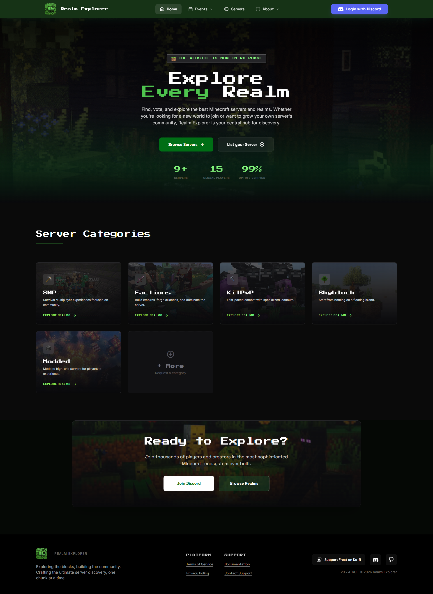

# 
# Realm Explorer

**Realm Explorer** is the easiest way to find your next Minecraft adventure. Whether you are looking for a new Realm to join or a massive Server to explore, we help you find the best communities in the Minecraft World.

## ✨ Features

### Finding Servers
- **Easy Browsing**: Quickly look through a list of Minecraft Servers and Realms.
- **Simple Filters**: Find exactly what you want—like SMP, Skyblock, or Factions—without getting lost.
- **Fast Search & Shuffle**: Type in the name of a server to find it instantly, or use the shuffle button to discover new servers!
- **Projects Explorer (Beta)**: Discover upcoming and in-development projects from the community.

### For the Community
- **Quick Voting**: Support your favorite servers! You can vote every 24 hours to help them get more attention.
- **ROTM & SOTM**: Vote for your favorite Realms and Servers of the Month, featuring live leaderboard updates!
- **Rate Servers**: Rate servers you have played on to help others find the best ones.
- **Discord Login**: Use your Discord account to sign in quickly and easily.

### For Server Owners
- **List in Minutes**: Adding your server or realm is super simple with our easy form.
- **Easy Management**: Use your own dashboard to change your server's details and social links whenever you want.
- **Analytics**: Track your server's votes, rating, and other stats from your dashboard.
- **Profile**: Manage your profile banner, bio and personal links.

---

  

  <a href="https://realmexplorer.xyz" style="text-decoration: none;">
    
     
    Visit Realm Explorer
  </a>

## 🛠️ Built With

  

- **React 19 & Vite** for a smooth experience.
- **Supabase** to keep your data safe.
- **Tailwind CSS** for a clean look.
- **Framer Motion** for subtle animations.

## 📝 License

Copyright (c) 2026 **[Jaderby Peñaranda](LICENSE)**. All Rights Reserved.  
Owned by **[Realm Explorer](https://discord.gg/realmexplorer)**.

Interested in helping out? Check out our **[Contributing Guide](CONTRIBUTING.md)**, **[Code of Conduct](CODE_OF_CONDUCT.md)**, and **[Security Policy](SECURITY.md)**!

