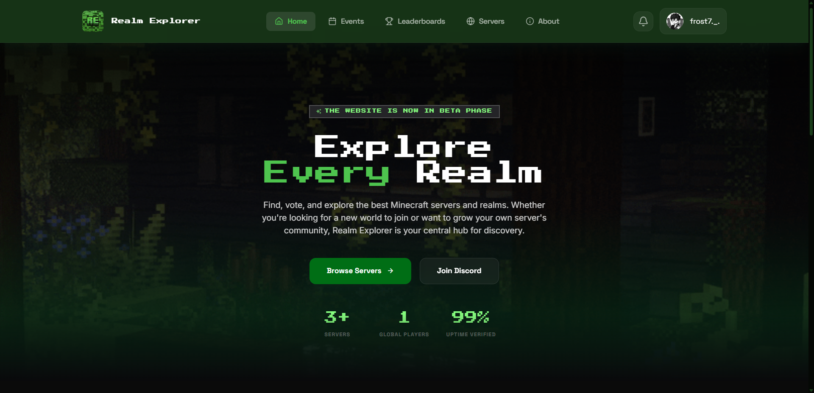

# 
# Realm Explorer

A **Minecraft Server & Realm Discovery Platform** designed for explorers to find their next adventure. Realm Explorer provides a sleek, modern interface for discovering, voting, and listing Minecraft communities.

## Features

### Discovery & Listings
- **Multiverse Discovery**: Browse a curated list of Minecraft Servers and Realms with ease.
- **Smart Filtering**: Filter by categories like SMP, Skyblock, Factions, KitPVP, and Modded to find exactly what you're looking for.
- **Instant Search**: Find your favorite servers instantly with our responsive search system.

### Community Interaction
- **Voting System**: Support your favorite servers and help them climb the leaderboards with a 24-hour recurring voting mechanism.
- **Discord Integration**: Seamlessly sign in using Discord OAuth to manage your listings and interact with the community.
- **Real-time Statistics**: View live player counts and up-to-date server information.

### For Server Owners
- **Effortless Submission**: List your Server or Realm in minutes with our intuitive submission form.
- **Listing Management**: Manage your listings through a dedicated dashboard—update descriptions, banners, and icons anytime.

### Administrative Control
- **Advanced Moderation**: A powerful admin panel for volunteers and staff to approve submissions and manage the ecosystem.
- **Role Management**: Hierarchical access system (Explorer, Moderator, Admin) ensuring a safe and organized community.

### Modern Design
- **Glassmorphism UI**: A truly premium feel with subtle glass effects, smooth transitions, and Minecraft-themed aesthetics.
- **Responsive Layout**: Designed to look stunning on every device, from mobile to ultra-wide monitors.

  

## Technology Stack

  

- **Frontend Core**: React 19, Vite 6, TypeScript
- **Backend & Auth**: Supabase (PostgreSQL, Auth, Storage)
- **Styling**: Tailwind CSS
- **State Management**: TanStack React Query
- **Animations**: Framer Motion
- **Icons & Typography**: Lucide React, Geist Variable Font
- **Deployment**: Optimized for Vercel

## License

This project is licensed under the **Proprietary License**.

Copyright (c) 2026 **[Jaderby Peñaranda](https://jaderbypenaranda.vercel.app/)**. All Rights Reserved.  
Proprietary to **[Realm Explorer](https://discord.gg/realmexplorer)**.
